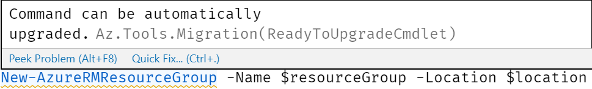

# Azure Powershell Tools

Effortlessly migrate your PowerShell scripts from AzureRM to the Az PowerShell module.

## Features

- AzureRM commands highlighting.
- Quick Fix for some AzureRM commands.

## Installing the Extension

You can install the official release of the Azure PowerShell extension by following the steps
in the [Visual Studio Code documentation](https://code.visualstudio.com/docs/editor/extension-gallery).
In the Extensions pane, search for "Azure PowerShell" extension and install it there.  You will
get notified automatically about any future extension updates!

## Usage

- Open or save a powershell file to activate the extension and start migration.

- Quick Fix

## License

This extension is [licensed under the MIT License](LICENSE.txt).
